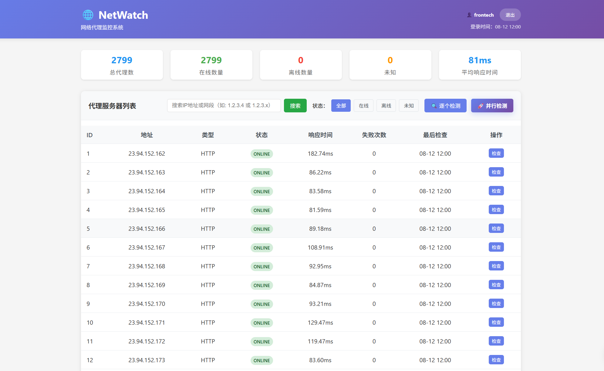

# NetWatch - Network Proxy Monitoring System

NetWatch is a high-performance PHP-based network proxy monitoring system designed specifically for monitoring the availability status of large numbers of SOCKS5 and HTTP proxies. It supports parallel processing and can efficiently monitor thousands of proxy servers.

## Features

- 🌐 **Multi-Protocol Support**: Supports SOCKS5 and HTTP proxy monitoring
- 🚀 **High-Performance Parallel Processing**: Supports multi-process parallel detection, up to 12 concurrent processes, 500 proxies per batch
- 📊 **Real-Time Monitoring**: Real-time detection of proxy server status and response times
- 📧 **Email Notifications**: Automatic email notifications when proxy failures occur
- 📈 **Web Interface**: Clean and beautiful web management interface
- 📝 **Logging**: Detailed monitoring logs and historical records
- 🔄 **Automatic Scheduling**: Background scheduled tasks for automatic monitoring
- 📥 **Batch Import**: Support for batch importing proxy configurations
- 💾 **SQLite Database**: Lightweight database with no additional configuration required
- ⏱️ **Timezone Support**: Automatic timezone conversion with Beijing time display support

## System Requirements

- PHP 8.0+
- cURL extension
- SQLite extension
- PCNTL extension (for parallel processing)
- POSIX extension
- Configured web server (Nginx + PHP-FPM or Apache)

## Performance Configuration

The system has the following default performance parameters configured, which you can adjust according to your server configuration (modify in `index.php`):

```php
define('PARALLEL_MAX_PROCESSES', 24);   // Maximum number of parallel processes
define('PARALLEL_BATCH_SIZE', 200);     // Number of proxies processed per batch
```

> 💡 **Performance Recommendations**:
> - For 4-core 8GB servers, it's recommended to keep the default configuration
> - For higher-spec servers, you can appropriately increase `PARALLEL_MAX_PROCESSES`
> - If network latency is high, you can appropriately reduce `PARALLEL_BATCH_SIZE`

## Installation Steps

### 1. Install Dependencies

```bash
# Install Composer dependencies
composer install
```

### 2. Configure System

Edit the `config.php` file and modify the following configurations:

```php
// Email configuration
define('SMTP_HOST', 'smtp.gmail.com');
define('SMTP_USERNAME', 'your-email@gmail.com');
define('SMTP_PASSWORD', 'your-password');
define('SMTP_TO_EMAIL', 'admin@example.com');

// Monitoring configuration
define('CHECK_INTERVAL', 300);  // Check interval (seconds)
define('TIMEOUT', 10);          // Timeout (seconds)
define('ALERT_THRESHOLD', 3);   // Consecutive failure threshold
```

### 3. Test System

```bash
php test.php
```

### 4. Import Proxies

Visit `http://your-domain/netwatch/import.php` or use command line:

```bash
# Import from file
php import.php
```

Proxy format examples:
```
192.168.1.100:1080:socks5
192.168.1.101:8080:http:username:password
10.0.0.1:1080:socks5:user:pass
```

### 5. Start Monitoring

```bash
# Start background monitoring service
php scheduler.php
```

Or use systemd service:

```bash
# Create service file
sudo nano /etc/systemd/system/netwatch.service
```

Service file content:
```ini
[Unit]
Description=NetWatch Monitor Service
After=network.target

[Service]
Type=simple
User=www-data
WorkingDirectory=/path/to/netwatch
ExecStart=/usr/bin/php scheduler.php
Restart=always
RestartSec=10

[Install]
WantedBy=multi-user.target
```

Start service:
```bash
sudo systemctl enable netwatch
sudo systemctl start netwatch
```

## Usage Instructions

### Web Interface

Visit `http://your-domain/netwatch/` to view the monitoring dashboard:



- **Statistics Overview**: Shows total proxy count, online/offline status, average response time
- **Proxy List**: Shows detailed status information for all proxies
- **Check Logs**: Shows recent monitoring check records
- **Manual Check**: Allows manual triggering of individual or all proxy checks

### Proxy Import

#### Individual Proxy Import

Visit `http://your-domain/netwatch/import.php` for batch import:

- Supports text paste import
- Supports file upload import
- Automatically skips incorrectly formatted lines
- Shows import result statistics

#### Subnet Batch Import

Visit `http://your-domain/netwatch/import_subnets.php` for subnet batch import:

- **Batch Generation**: Supports multiple subnets using the same port/username/password configuration
- **IP Range**: Define subnet ranges through start IP and end IP
- **Multi-Subnet Support**: Up to 20 different subnets can be configured simultaneously
- **Preview Function**: Preview the number of proxies to be generated before import
- **Import Modes**: Supports skip duplicates, overwrite updates, and other modes

Usage examples:
- Subnet 1: 192.168.1.2 to 192.168.1.30 (29 proxies)
- Subnet 2: 10.0.0.10 to 10.0.0.50 (41 proxies)
- Unified configuration: Port 1080, SOCKS5 protocol, username/password

### Email Notifications

The system sends emails in the following situations:

- **Failure Notifications**: When proxies fail consecutively reaching the threshold
- **Daily Reports**: System status reports sent daily at 9 AM

## Configuration File Description

### config.php

| Configuration Item | Description | Default Value |
|-------------------|-------------|---------------|
| `DB_PATH` | SQLite database file path | `./data/netwatch.db` |
| `SMTP_HOST` | SMTP server address | `smtp.gmail.com` |
| `SMTP_PORT` | SMTP port | `587` |
| `CHECK_INTERVAL` | Check interval (seconds) | `300` |
| `TIMEOUT` | Connection timeout (seconds) | `10` |
| `ALERT_THRESHOLD` | Failure notification threshold | `3` |
| `TEST_URL` | Test URL | `http://httpbin.org/ip` |

## Directory Structure

```
NetWatch/
├── config.php                # Main configuration file
├── index.php                # Main entry file, Web interface
├── auth.php                 # User authentication module
├── database.php             # Database operation class
├── monitor.php              # Single-process monitoring implementation
├── parallel_monitor.php      # Parallel monitoring implementation
├── parallel_worker.php       # Parallel worker process
├── parallel_batch_manager.php # Batch task management
├── import.php               # Proxy import script
├── import_subnets.php        # Subnet batch import tool
├── mailer.php               # Email notification module
├── logger.php               # Logging module
├── scheduler.php            # Scheduled task scheduler
├── clear_proxies.php        # Proxy cleanup tool
├── login.php                # Login page
├── config.example.php       # Configuration file example
├── composer.json            # Composer dependency configuration
├── data/                    # Data directory
│   └── netwatch.db         # SQLite database
├── logs/                    # Log directory
│   └── netwatch_*.log      # Log files
├── Debug/                   # Debug-related files
└── Docs/                    # Documentation directory
```

### Main File Descriptions

- **config.php** - System configuration file containing database connections, email settings, etc.
- **index.php** - Main entry file providing web management interface
- **monitor.php** - Single-process proxy monitoring implementation
- **parallel_*.php** - Parallel monitoring related files supporting high-performance batch detection
- **import*.php** - Proxy import tools supporting individual proxy and subnet batch import
- **mailer.php** - Email notification module for sending alerts
- **logger.php** - Logging module for recording system runtime status
- **scheduler.php** - Scheduled task scheduler for periodic monitoring execution

## API Interface

The system provides simple AJAX APIs:

- `GET /?ajax=1&action=stats` - Get statistics information
- `GET /?ajax=1&action=check&proxy_id=1` - Check specified proxy
- `GET /?ajax=1&action=logs` - Get recent logs

## Troubleshooting

### Common Issues

1. **Database Connection Failed**
   - Check data directory permissions
   - Ensure PHP has SQLite extension

2. **Email Sending Failed**
   - Check SMTP configuration
   - Confirm email password is correct
   - May need to use app-specific password

3. **Proxy Check Failed**
   - Check network connection
   - Confirm curl extension is installed
   - Check firewall settings

4. **Permission Issues**
   - Ensure web server has write permissions to data and logs directories
   - Check file ownership and permission settings

### Log Viewing

```bash
# View latest logs
tail -f logs/netwatch_$(date +%Y-%m-%d).log

# View error logs
grep ERROR logs/netwatch_*.log
```

## Performance Optimization

For monitoring large numbers of proxies (5000+):

1. **Adjust Check Interval**: Adjust `CHECK_INTERVAL` as needed
2. **Concurrent Checking**: Can modify code to implement multi-threaded checking
3. **Database Optimization**: Regularly clean old log data
4. **Caching Mechanism**: Can add Redis caching to improve performance

## License

MIT License

