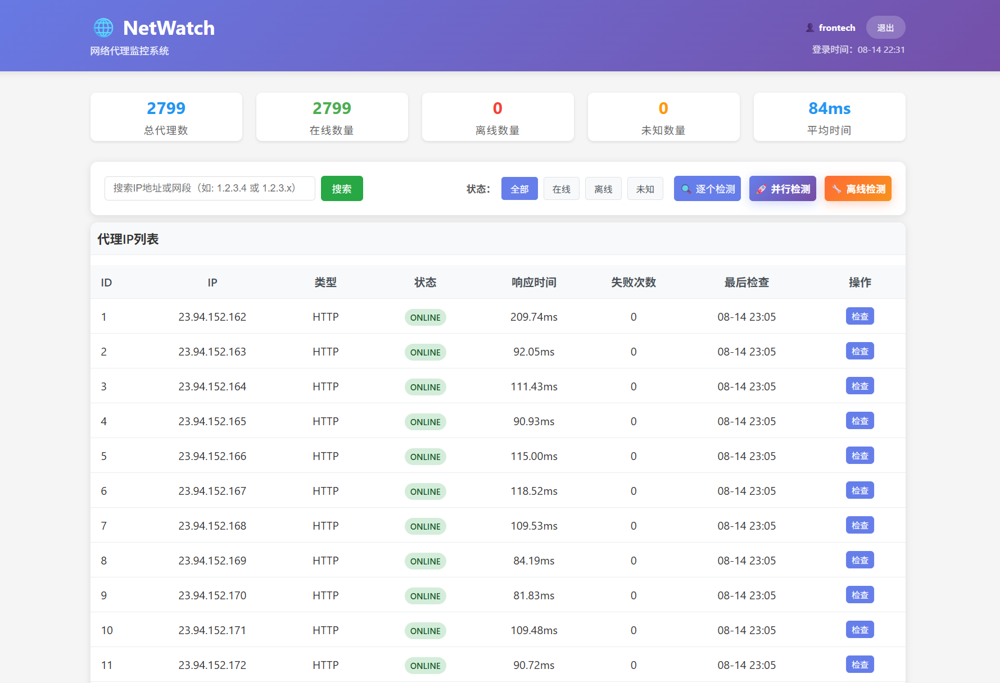

# NetWatch - 网络代理监控系统

NetWatch 是一个基于PHP的高性能网络代理监控系统，专门用于监控大量SOCKS5和HTTP代理的可用性状态。支持并行处理，能够高效地监控数千个代理服务器。

## 功能特性

- 🌐 **多协议支持**: 支持SOCKS5和HTTP代理监控
- 🚀 **高性能并行处理**: 支持多进程并行检测，最高可同时处理12个进程，每批次500个代理
- 📊 **实时监控**: 实时检测代理服务器状态和响应时间
- 📧 **邮件通知**: 代理故障时自动发送邮件通知
- 📈 **Web界面**: 简洁美观的Web管理界面
- 📝 **日志记录**: 详细的监控日志和历史记录
- 🔄 **自动调度**: 后台定时任务自动执行监控
- 📥 **批量导入**: 支持批量导入代理配置
- 💾 **SQLite数据库**: 轻量级数据库，无需额外配置
- ⏱️ **时区支持**: 自动处理时区转换，支持北京时间显示

## 系统要求

- PHP 8.0+
- cURL扩展
- SQLite扩展
- PCNTL扩展（用于并行处理）
- POSIX扩展
- 已配置的Web服务器 (Nginx + PHP-FPM 或 Apache)

## 性能配置

系统默认配置了以下性能参数，您可以根据服务器配置进行调整（在`index.php`中修改）：

```php
define('PARALLEL_MAX_PROCESSES', 24);   // 最大并行进程数
define('PARALLEL_BATCH_SIZE', 200);     // 每批次处理的代理数量
```

> 💡 **性能建议**：
> - 对于4核8G服务器，建议保持默认配置
> - 对于更高配置的服务器，可以适当增加`PARALLEL_MAX_PROCESSES`
> - 如果网络延迟较高，可以适当减少`PARALLEL_BATCH_SIZE`

## 安装步骤

### 1. 安装依赖

```bash
# 安装Composer依赖
composer install
```

### 2. 配置系统

编辑 `config.php` 文件，修改以下配置：

```php
// 邮件配置
define('SMTP_HOST', 'smtp.gmail.com');
define('SMTP_USERNAME', 'your-email@gmail.com');
define('SMTP_PASSWORD', 'your-password');
define('SMTP_TO_EMAIL', 'admin@example.com');

// 监控配置
define('CHECK_INTERVAL', 300);  // 检查间隔（秒）
define('TIMEOUT', 10);          // 超时时间（秒）
define('ALERT_THRESHOLD', 3);   // 连续失败次数阈值
```

### 3. 测试系统

```bash
php test.php
```

### 4. 导入代理

访问 `http://your-domain/netwatch/import.php` 或使用命令行：

```bash
# 从文件导入
php import.php
```

代理格式示例：
```
192.168.1.100:1080:socks5
192.168.1.101:8080:http:username:password
10.0.0.1:1080:socks5:user:pass
```

### 5. 启动监控

```bash
# 启动后台监控服务
php scheduler.php
```

或者使用systemd服务：

```bash
# 创建服务文件
sudo nano /etc/systemd/system/netwatch.service
```

服务文件内容：
```ini
[Unit]
Description=NetWatch Monitor Service
After=network.target

[Service]
Type=simple
User=www-data
WorkingDirectory=/path/to/netwatch
ExecStart=/usr/bin/php scheduler.php
Restart=always
RestartSec=10

[Install]
WantedBy=multi-user.target
```

启动服务：
```bash
sudo systemctl enable netwatch
sudo systemctl start netwatch
```

## 使用说明

### Web界面

访问 `http://your-domain/netwatch/` 查看监控面板：



- **统计概览**: 显示代理总数、在线/离线状态、平均响应时间
- **代理列表**: 显示所有代理的详细状态信息
- **检查日志**: 显示最近的监控检查记录
- **手动检查**: 可以手动触发单个或全部代理检查

### 代理导入

#### 单个代理导入

访问 `http://your-domain/netwatch/import.php` 进行批量导入：

- 支持文本粘贴导入
- 支持文件上传导入
- 自动跳过格式错误的行
- 显示导入结果统计

#### 子网批量导入

访问 `http://your-domain/netwatch/import_subnets.php` 进行子网批量导入：

- **批量生成**: 支持多个子网使用相同的端口/用户名/密码配置
- **IP范围**: 通过起始IP和结束IP定义子网范围
- **多子网支持**: 最多可同时配置20个不同的子网
- **预览功能**: 导入前可预览将生成的代理数量
- **导入模式**: 支持跳过重复、覆盖更新等模式

使用示例：
- 子网1: 192.168.1.2 到 192.168.1.30 (29个代理)
- 子网2: 10.0.0.10 到 10.0.0.50 (41个代理)
- 统一配置: 端口1080, SOCKS5协议, 用户名/密码

### 邮件通知

系统会在以下情况发送邮件：

- **故障通知**: 代理连续失败达到阈值时
- **每日报告**: 每天上午9点发送系统状态报告

## 配置文件说明

### config.php

| 配置项 | 说明 | 默认值 |
|--------|------|--------|
| `DB_PATH` | SQLite数据库文件路径 | `./data/netwatch.db` |
| `SMTP_HOST` | SMTP服务器地址 | `smtp.gmail.com` |
| `SMTP_PORT` | SMTP端口 | `587` |
| `CHECK_INTERVAL` | 检查间隔（秒） | `300` |
| `TIMEOUT` | 连接超时时间（秒） | `10` |
| `ALERT_THRESHOLD` | 故障通知阈值 | `3` |
| `TEST_URL` | 测试URL | `http://httpbin.org/ip` |

## 目录结构

```
NetWatch/
├── config.php                # 主配置文件
├── index.php                # 主入口文件，Web界面
├── auth.php                 # 用户认证模块
├── database.php             # 数据库操作类
├── monitor.php              # 单进程监控实现
├── parallel_monitor.php      # 并行监控实现
├── parallel_worker.php       # 并行工作进程
├── parallel_batch_manager.php # 批量任务管理
├── import.php               # 代理导入脚本
├── import_subnets.php        # 子网批量导入工具
├── mailer.php               # 邮件通知模块
├── logger.php               # 日志记录模块
├── scheduler.php            # 定时任务调度器
├── clear_proxies.php        # 代理清理工具
├── login.php                # 登录页面
├── config.example.php       # 配置文件示例
├── composer.json            # Composer依赖配置
├── data/                    # 数据目录
│   └── netwatch.db         # SQLite数据库
├── logs/                    # 日志目录
│   └── netwatch_*.log      # 日志文件
├── Debug/                   # 调试相关文件
└── Docs/                    # 文档目录
```

### 主要文件说明

- **config.php** - 系统配置文件，包含数据库连接、邮件设置等
- **index.php** - 主入口文件，提供Web管理界面
- **monitor.php** - 单进程代理监控实现
- **parallel_*.php** - 并行监控相关文件，支持高性能批量检测
- **import*.php** - 代理导入工具，支持单个代理和子网批量导入
- **mailer.php** - 邮件通知模块，用于发送告警
- **logger.php** - 日志记录模块，记录系统运行状态
- **scheduler.php** - 定时任务调度器，用于定期执行监控

## API接口

系统提供简单的AJAX API：

- `GET /?ajax=1&action=stats` - 获取统计信息
- `GET /?ajax=1&action=check&proxy_id=1` - 检查指定代理
- `GET /?ajax=1&action=logs` - 获取最近日志

## 故障排除

### 常见问题

1. **数据库连接失败**
   - 检查data目录权限
   - 确保PHP有SQLite扩展

2. **邮件发送失败**
   - 检查SMTP配置
   - 确认邮箱密码正确
   - 可能需要使用应用专用密码

3. **代理检查失败**
   - 检查网络连接
   - 确认curl扩展已安装
   - 检查防火墙设置

4. **权限问题**
   - 确保Web服务器对data和logs目录有写权限
   - 检查文件所有者和权限设置

### 日志查看

```bash
# 查看最新日志
tail -f logs/netwatch_$(date +%Y-%m-%d).log

# 查看错误日志
grep ERROR logs/netwatch_*.log
```

## 性能优化

对于大量代理（5000+）的监控：

1. **调整检查间隔**: 根据需要调整`CHECK_INTERVAL`
2. **并发检查**: 可以修改代码实现多线程检查
3. **数据库优化**: 定期清理旧日志数据
4. **缓存机制**: 可以添加Redis缓存提高性能

## 许可证

MIT License
